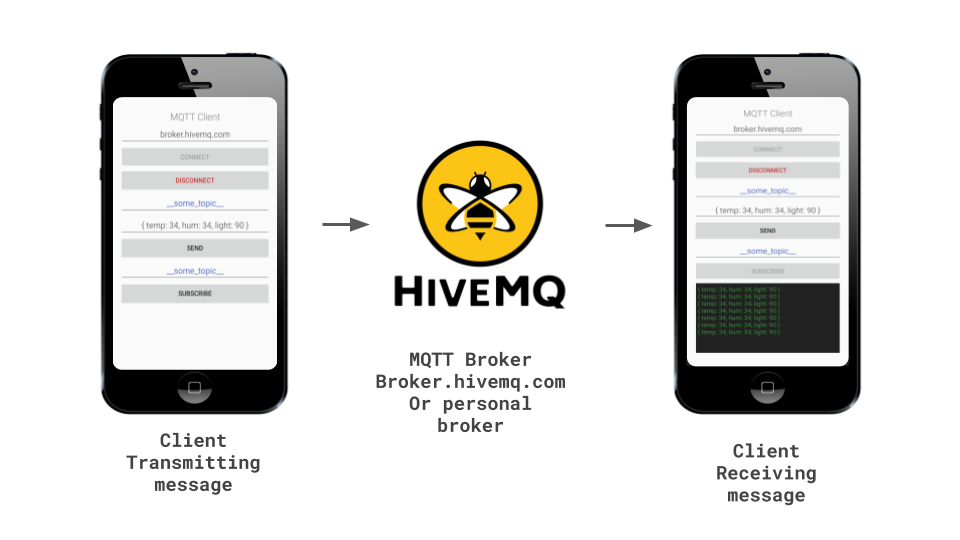

# MQTT Client Android  
  

  

## Features
|                     |                    |   |                      |                    |
|---------------------|--------------------|---|----------------------|--------------------|
| MQTT 3.1            | :heavy_check_mark: |   | Automatic Reconnect  | :heavy_check_mark: |
| MQTT 3.1.1          | :heavy_check_mark: |   | Offline Buffering    | :heavy_check_mark: |
| LWT                 | :heavy_check_mark: |   | WebSocket Support    | :heavy_check_mark: |
| SSL / TLS           | :heavy_check_mark: |   | Standard TCP Support | :heavy_check_mark: |
| Message Persistence | :heavy_check_mark: |   |

## License

This work is licensed under [Apache-2.0](https://www.apache.org/licenses/LICENSE-2.0).
